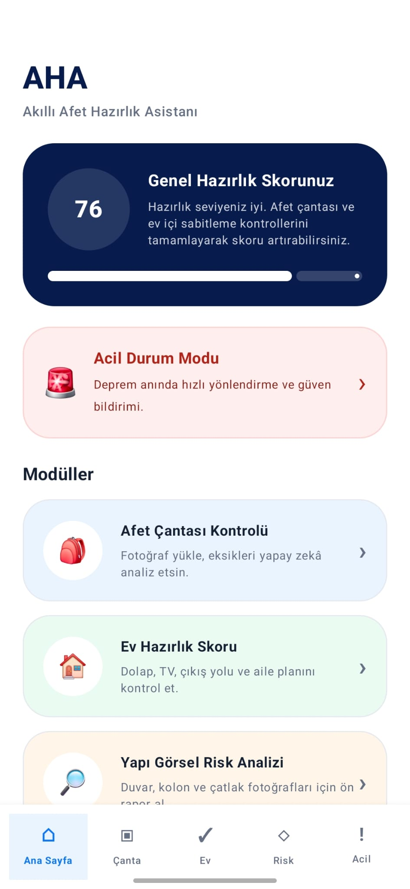
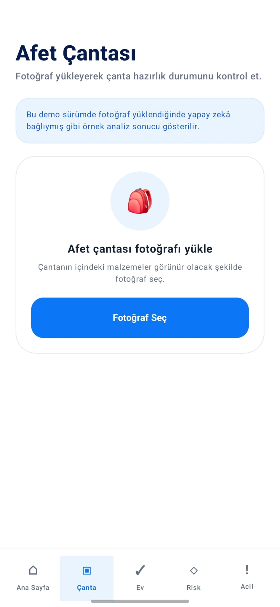
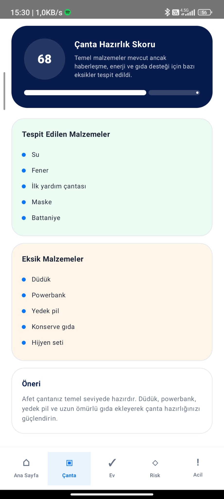
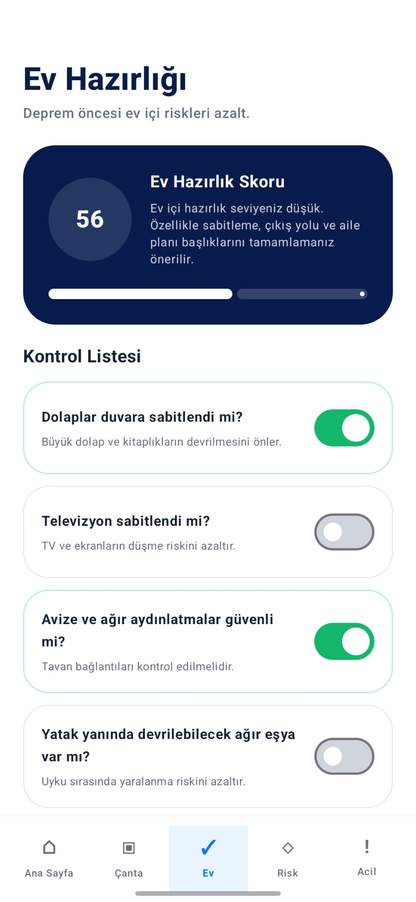
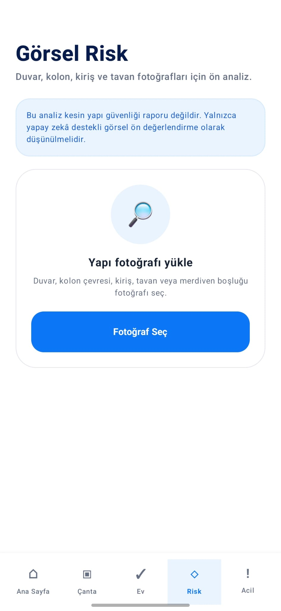
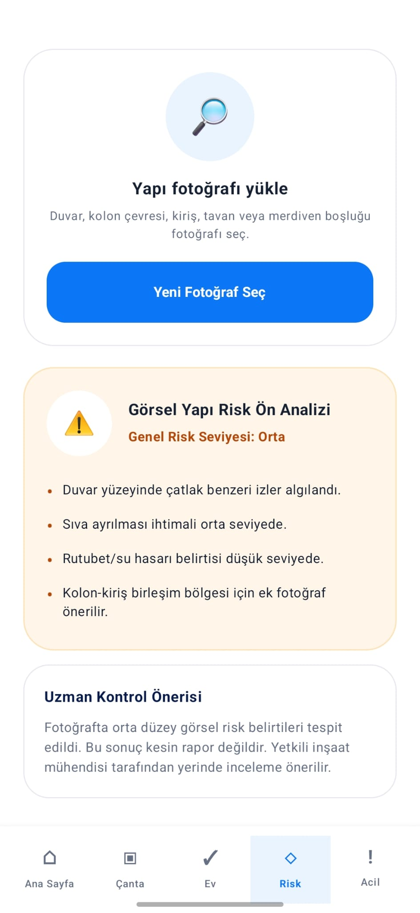
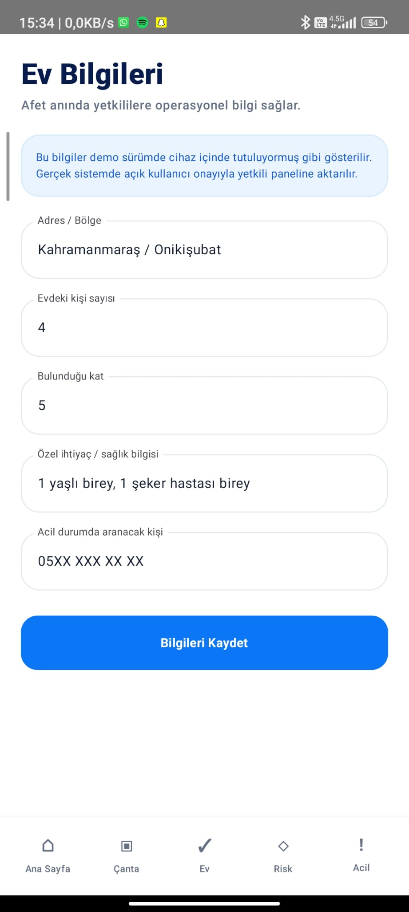
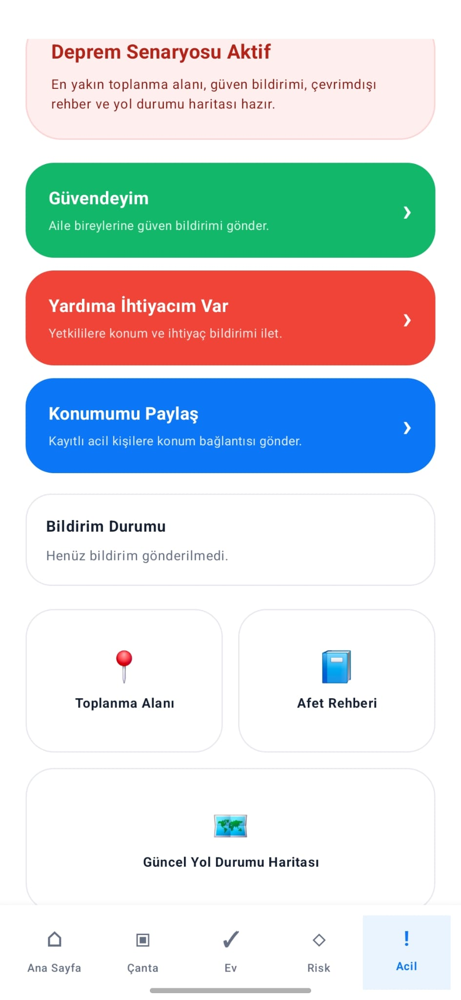
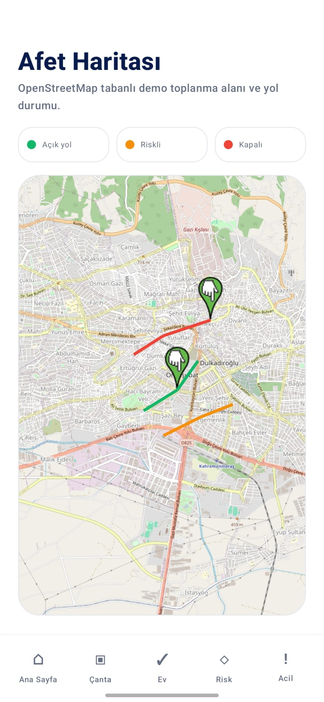
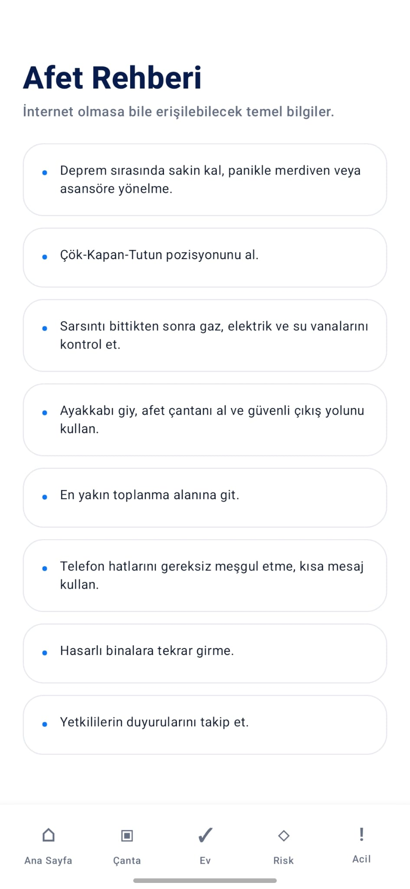

# AHA - Akıllı Afet Hazırlık Asistanı

AHA, afet öncesi hazırlık süreçlerini dijitalleştiren, kullanıcıların afet çantası, ev içi güvenlik, yapı görsel risk durumu ve acil durum aksiyonlarını tek bir mobil uygulama üzerinden yönetmesini amaçlayan Kotlin tabanlı bir mobil afet hazırlık asistanıdır.

Uygulama; bireysel kullanıcıların afet öncesi hazırlık seviyesini artırmayı, deprem anında hızlı yönlendirme sağlamayı ve afet sonrası ihtiyaçların daha düzenli şekilde takip edilebilmesini hedefler.

---

## Proje Amacı

Afet anlarında en kritik problemlerden biri, bireylerin ve hanelerin afet öncesi hazırlık seviyesinin düşük olmasıdır. AHA; kullanıcıların afet hazırlığını ölçen, eksikleri gösteren ve acil durumlarda kullanıcıyı doğru aksiyonlara yönlendiren bütünleşik bir mobil çözüm olarak geliştirilmiştir.

Uygulama kapsamında kullanıcılar:

- Afet çantası hazırlık durumunu kontrol edebilir.
- Ev içi deprem hazırlık kontrol listesini tamamlayabilir.
- Duvar, kolon, kiriş ve tavan gibi alanlar için görsel risk ön değerlendirme süreci başlatabilir.
- Deprem anında acil durum moduna geçebilir.
- En yakın toplanma alanı ve yol durumu haritasına erişebilir.
- Evdeki kişi sayısı ve özel ihtiyaç bilgilerini sisteme kaydedebilir.

---

## Temel Özellikler

### 1. Afet Çantası Kontrol Modülü

Kullanıcı, afet çantasının fotoğrafını yükleyerek çanta içeriğinin analiz edilmesini sağlar. Sistem, afet çantasında bulunması gereken temel malzemeleri kontrol eder ve eksik olanları kullanıcıya bildirir.

Kontrol edilebilecek örnek malzemeler:

- Su
- Fener
- Pil
- Düdük
- İlk yardım çantası
- Maske
- Powerbank
- Battaniye
- Konserve gıda
- Hijyen malzemeleri
- İlaç
- Kimlik ve önemli belge kopyaları

Geliştirilecek yapay zekâ modeliyle afet çantası içeriği YOLO tabanlı nesne tespit algoritmaları kullanılarak analiz edilecektir.

---

### 2. Ev İçi Deprem Hazırlık Kontrol Listesi

Deprem sırasında risk yalnızca binanın taşıyıcı sisteminden kaynaklanmaz. Ev içinde sabitlenmemiş eşyalar, kapalı çıkış yolları ve eksik güvenlik önlemleri de ciddi tehlike oluşturabilir.

Bu modülde kullanıcı aşağıdaki başlıkları kontrol edebilir:

- Dolaplar duvara sabitlendi mi?
- Televizyon sabitlendi mi?
- Avize ve ağır aydınlatmalar güvenli mi?
- Yatak yanında devrilebilecek ağır eşya var mı?
- Acil çıkış yolu açık mı?
- Doğalgaz vanası erişilebilir mi?
- Yangın söndürücü var mı?
- Aile afet planı oluşturuldu mu?
- Toplanma alanı biliniyor mu?
- Yaşlı, çocuk, engelli veya evcil hayvan için özel plan var mı?
- Apartman veya site acil çıkış planı biliniyor mu?

Kontrol sonucunda kullanıcıya ev hazırlık skoru sunulur.

---

### 3. Duvar ve Yapı Görsel Risk Analizi

Kullanıcı, binadaki veya evindeki çeşitli yapı elemanlarının fotoğraflarını uygulamaya yükleyebilir. Bu görseller üzerinden yapay zekâ destekli ön değerlendirme yapılması hedeflenmektedir.

Analiz edilebilecek görsel belirtiler:

- Çatlaklar
- Sıva ayrılmaları
- Kolon ve kiriş çevresindeki deformasyonlar
- Rutubet ve su hasarı
- Dökülme ve kabarma
- Yapısal olmayan hasar izleri
- Deprem sonrası oluşan yeni çatlak yoğunluğu

Bu modül, kesin yapı güvenliği raporu üretmek yerine görsel belirtilere dayalı ön risk değerlendirmesi sunmayı amaçlar. Geliştirilecek sistemde görüntü işleme, sınıflandırma, nesne tespiti ve segmentasyon teknikleri birlikte kullanılabilir.

---

### 4. Deprem Algılama ve Acil Durum Modu

Uygulama, deprem algılandığında veya kullanıcı tarafından manuel olarak başlatıldığında acil durum moduna geçer.

Acil durum modunda sunulan özellikler:

- En yakın toplanma alanını görüntüleme
- Aile bireylerine “Güvendeyim” bildirimi gönderme
- Yardım ihtiyacı bildirimi oluşturma
- Konum paylaşma
- Çevrimdışı afet rehberine erişme
- Bina veya site acil çıkış planını görüntüleme
- Güncel yol durumu haritasına erişme

İlerleyen aşamalarda merkezi deprem verileri, erken uyarı sistemleri ve sensör tabanlı bildirim altyapıları ile entegrasyon sağlanması hedeflenmektedir.

---

### 5. Kişisel Ev ve İhtiyaç Bilgileri

Kullanıcı, afet anında yetkililer tarafından kullanılabilecek operasyonel ev bilgilerini sisteme kaydedebilir.

Kaydedilebilecek bilgiler:

- Evdeki kişi sayısı
- Bulunulan kat
- Acil durumda aranacak kişi
- Yaşlı birey bilgisi
- Çocuk veya bebek bilgisi
- Engelli birey bilgisi
- Kronik hastalık veya düzenli ilaç ihtiyacı
- Tahliye desteği ihtiyacı
- Evcil hayvan bilgisi

Bu bilgiler afet anında önceliklendirme, yardım planlama ve tahliye yönetimi süreçlerinde kullanılabilecek şekilde tasarlanmıştır.

---

### 6. Afet Haritası

Uygulama içerisinde OpenStreetMap tabanlı harita altyapısı kullanılır. Harita ekranında toplanma alanları, yol durumu ve kritik destek noktaları görüntülenebilir.

Harita üzerinde gösterilebilecek yol durumları:

- Açık yol
- Riskli veya kısmen geçilebilir yol
- Kapalı yol
- Acil yardım güzergâhı
- Toplanma alanı
- Sağlık destek noktası

İlerleyen aşamalarda otonom İHA görüntülerinden alınan verilerle yol kapanması, enkaz yoğunluğu ve güvenli güzergâh tespiti yapılması hedeflenmektedir.

---

## Ekran Görüntüleri

Aşağıdaki görseller AHA mobil uygulamasına ait ekran görüntüleridir.

### 1. Ana Sayfa



### 2. Afet Çantası Kontrol Ekranı



### 3. Afet Çantası Analiz Sonucu



### 4. Ev İçi Deprem Hazırlık Kontrol Listesi



### 5. Ev Hazırlık Skoru


### 6. Duvar ve Yapı Görsel Risk Analizi



### 7. Görsel Risk Analiz Raporu



### 8. Kişisel Ev Bilgileri



### 9. Acil Durum Modu



### 10. Afet Haritası



### 11. Çevrimdışı Afet Rehberi


## Kullanılan Teknolojiler

- Kotlin
- Jetpack Compose
- Android SDK
- Material 3
- OpenStreetMap
- osmdroid
- MVVM mimarisine uygun geliştirilebilir yapı
- Görüntü işleme entegrasyonu için YOLO tabanlı model mimarisi
- Gelecek aşamalar için REST API entegrasyon altyapısı
- Konum tabanlı afet yönlendirme sistemi

---

## Planlanan Teknik Geliştirmeler

### Yapay Zekâ ve Görüntü İşleme

- YOLO tabanlı afet çantası nesne tespit modeli
- Duvar ve yapı hasarı için görüntü sınıflandırma modeli
- Çatlak tespiti için segmentasyon modeli
- Kolon, kiriş, tavan ve duvar yüzeylerinden görsel risk çıkarımı
- Fotoğraf kalitesi kontrol algoritması
- Görsel analiz raporlarının otomatik oluşturulması

### Afet Çantası Analizi

- Nesne tespit modeli ile malzeme sınıflandırma
- Eksik malzeme öneri sistemi
- Son kullanma tarihi takibi
- Kullanıcıya özel afet çantası önerisi
- Aile kişi sayısına göre çanta yeterlilik analizi

### Ev İçi Risk Analizi

- Kontrol listesi ağırlıklandırma sistemi
- Ev hazırlık skoru hesaplama algoritması
- Riskli eşya sabitleme önerileri
- Aile afet planı oluşturma sihirbazı
- Ev içi güvenlik iyileştirme önerileri

### Yapı Görsel Ön Değerlendirme

- Çatlak yönü ve yoğunluğu analizi
- Rutubet ve su hasarı tespiti
- Sıva ayrılması ve yüzey deformasyonu sınıflandırması
- Risk seviyesi sınıflandırma algoritması
- Mühendislik incelemesi öneri sistemi

### Acil Durum Altyapısı

- Merkezi deprem servisleriyle entegrasyon
- Erken uyarı sistemi bağlantısı
- SMS tabanlı acil bildirim
- Push notification altyapısı
- Çevrimdışı çalışma desteği
- Aile ve komşu güvenlik ağı

### Harita ve Konum Servisleri

- OpenStreetMap tabanlı canlı afet haritası
- Toplanma alanı yönlendirmesi
- Yol kapanma ve riskli güzergâh gösterimi
- Otonom İHA verisi ile güncel yol durumu analizi
- Afet sonrası güvenli rota önerisi
- Acil yardım güzergâhı optimizasyonu

### Otonom İHA Entegrasyonu

- Deprem sonrası otomatik İHA kalkış senaryosu
- Önceden tanımlı mahalle tarama rotası
- İHA görüntülerinden yol kapanma tespiti
- Afet öncesi ve sonrası görüntü karşılaştırma
- Enkaz, yoğunluk ve erişim problemi analizi
- Harita üzerine gerçek zamanlı veri aktarımı

### Yetkili ve Yönetici Paneli

- Bölgesel hazırlık skoru takibi
- Özel ihtiyaç sahibi hanelerin operasyonel listesi
- Yardım ihtiyacı bildirim ekranı
- Yapı görsel risk raporu yönetimi
- Yol durumu ve toplanma alanı yoğunluk takibi
- Site, blok ve mahalle bazlı afet hazırlık karnesi

### Veri ve Backend Altyapısı

- Kullanıcı yönetimi
- Ev ve hane bilgileri yönetimi
- Afet çantası analiz kayıtları
- Görsel risk analiz kayıtları
- Acil durum bildirim kayıtları
- Harita ve yol durumu verileri
- Yetkili erişim rolleri
- Güvenli veri saklama ve yetkilendirme

---

## Önerilen Proje Yapısı

```text
AHA
├── app
│   ├── src
│   │   └── main
│   │       ├── AndroidManifest.xml
│   │       └── java/com/aha/afethazirlikasistani
│   │           └── MainActivity.kt
│   └── build.gradle.kts
├── screenshots
│   ├── 1.png
│   ├── 2.png
│   ├── 3.png
│   ├── 4.png
│   ├── 5.png
│   ├── 6.png
│   ├── 7.png
│   ├── 8.png
│   ├── 9.png
│   ├── 10.png
│   └── 11.png
├── build.gradle.kts
├── settings.gradle.kts
└── README.md
```

---

## Kurulum

Projeyi yerel ortamda çalıştırmak için:

```bash
git clone https://github.com/kullanici-adi/aha-afet-hazirlik-asistani.git
```

```bash
cd aha-afet-hazirlik-asistani
```

Android Studio ile projeyi açın ve Gradle senkronizasyonunu tamamlayın.

---

## Android Gereksinimleri

- Android Studio
- Kotlin
- Minimum SDK: 26
- Target SDK: 35
- Gradle JDK: 17
- İnternet izni
- Konum ve harita servisleri için gerekli Android izinleri

---

## Geliştirme Yol Haritası

1. Mobil arayüz geliştirme
2. Afet çantası kontrol algoritması
3. Ev içi hazırlık skoru sistemi
4. Yapı görsel risk analiz altyapısı
5. OpenStreetMap tabanlı afet haritası
6. Acil durum modu ve bildirim altyapısı
7. YOLO tabanlı görüntü işleme entegrasyonu
8. Backend ve kullanıcı veri yönetimi
9. Yetkili paneli geliştirme
10. Otonom İHA destekli yol durumu analizi

---

## Lisans

Bu proje afet hazırlık süreçlerinde dijital farkındalık oluşturmak ve akıllı afet yönetimi çözümleri geliştirmek amacıyla hazırlanmıştır.

---

## Geliştirici
YUNUS YAMAN
**AHA - Akıllı Afet Hazırlık Asistanı**  
Afet öncesi hazırlık, afet anı yönlendirme ve afet sonrası veri destekli müdahale süreçleri için geliştirilen mobil afet yönetim platformu.
